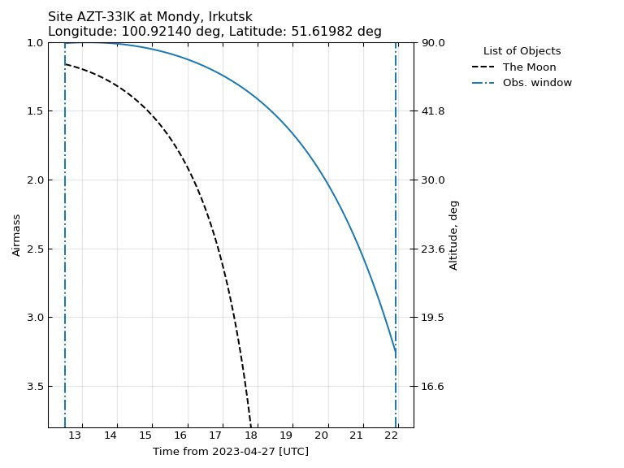
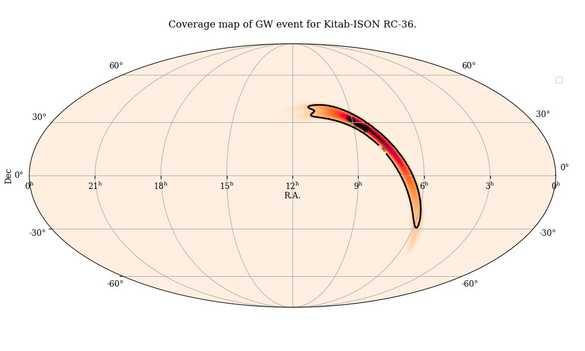

# AWARE

**"AWARE"** is acronim for **"Alert Watcher and Astronomical Rapid Exploration"** is a 
Python application for receiving and processing the Kafka Messages distributed via the 
GCN https://gcn.nasa.gov broker for alerts on high-energy transient events such as 
GRBs and gravitational wave events detected by LIGO/Virgo/KAGRA interferometers. 
Besides that, **AWARE** provides optimal scheduling for the observations of these 
astronomical phenomena with telescopes. The AWARE uses gcn_kafka 
https://github.com/nasa-gcn/gcn-kafka-python and confluent_kafka 
https://github.com/confluentinc/confluent-kafka-python under the hood, which provide convinient way for working with GCN/TAN Confluent Kafka broker. Once alert message were received by the AWARE, they almost immediately sent to the subscribers of the Telegram channel. After that, the AWARE is making observational plan for the specified list of observatories depending on the event type (more detailed in next paragraphs).

# Installation

Download an .whl file from tags and run pip:

`pip install AWARE-0.1.0-py3-none-any.whl --no-build-isolation`

Or build from source:
   ```
   git clone https://github.com/mickolaua/aware-repo.git

   cd aware repo

   pip install .
   ```

# Receiving GCN alerts

The simplest way to receive messages is when a person has an access to the Telegram 
channel controlled by the AWARE bot instance. One just needs to subscribe to the 
channel via inventation link.

It is possible to deploy your own bot instance. First off, one needs to authorize to 
the <gcn.nasa.gov> and get credentials (id and secret) to receive raw messages from 
GCN. After that, set-up enviromental variables:

PowerShell:

``$Env:GCN_KAFKA_CLIENT_ID="<your actual id>"``

``$Env:GCN_KAFKA_CLIENT_SECRET="<your actual secret>"``

Bourne shell (bash/sh/zsh):

``export GCN_KAFKA_CLIENT_ID=<your actual id>``

``export GCN_KAFKA_CLIENT_SECRET=<your actual secret>``

Go ahead and install the aware package like specified in previous paragraph 
**Installation**.

Next step is to get credentials for the Telegram bot creation. In the Telegram one has 
to contact https://telegram.me/BotFather, choose bot name and get API token. The great tutorial with screenshots on how to do that could be find, for example, here 
<https://sendpulse.com/knowledge-base/chatbot/telegram/create-telegram-chatbot>. Then, 
write this API token to the enviromental variable:

PowerShell:

``$Env:AWARE_TG_API_TOKEN="<your actual API token>"``

Bourne shell (bash/sh/zsh):

``export AWARE_TG_API_TOKEN=<your actual API token>``

Now everything is completed to run the AWARE. Just type this command in any shell:

``python -m aware -t``

Note. Ommiting the `-t` flag disables the Telegram thread. It is desired to create a working folder in which the AWARE will be executed, 
since there are a lot of observational plots and plans could be generated during 
its run. 

Optionally, one can overwrite the default options like, list of event types to listen, 
logging format, and other parameters. The default config file `aware.yaml` is located 
in this repository. Access to the config file is provided via enviromental variable:

PowerShell:

``$Env:AWARE_CONFIG_FILE="path/to/config.yaml"``

Bourne Shell (bash, sh, zsh):

``export AWARE_CONFIG_FILE=path/to/config.yaml``


# Interaction with bot

A Telegram user can interact with bot using these commands:

`/status` - Check if bot is idle or broadcasting messages.

`/telescopes` - Get the list of telescopes for which observation planning is available.

`/topics` - Get the list of GCN event types to be received

`/sub` - Subscribe for messages and observational plans

`/unsub` - subscribe from bot

`/help` - Display the help on bot commands.

`/findchart [TRANSIENT_NAME] [RA] [DEC]` - DSS finding chart of 
the target TRANSIENT_NAME


Planning the observations
=========================
The planner extracts neccessary information on an event from alert messages. Depending on the alert type (for example, SWIFT_XRT_POSITION or LVC_PRELIMENARY) this information could differ, since there a lot of instrument-related parameters. Actually, it is assumed two main classes of alert messages. First one, are sent by such observatories as Fermi, Swift, INTEGRAL, IceCube. They provide approximately circular sky error region in the sky. In this case, a typical localization area is up to a few degrees (excluding Fermi GBM). For these events, the planner creates the airmass plot 
for the center of the localization region, if the target could be observable by a telescope.

For example, the content that will be send by the bot on an XRT alert is following:

```
From: Swift XRT
Event: 1165948
Trigger: 2023-04-27T10:33:34+00:00 UTC
Packet: gcn.classic.voevent.SWIFT_XRT_POSITION

Area: 3.8e-06 deg^2
RA: 10:13:14.5 (153.310600 d, J2000)
Dec: +48:12:15 (+48.204300, J2000)
l: 167.6093 d
b: +52.8749 d
Error: 3.96 arcsec
```

The corresponding observatory-related target list file will include only one target, for example in `.txt` format for observatories that do not have automatic scheduler:

```
# 
ra dec exp filter
10:13:14.9 +48:12:13 120.0x3 R
```

or in `.list` format for automatic scheduling:

```
J101314.90+481213.00 = F 101314.90 +481213.00 3x120.0*R
```

The example of a visibility plot associated with this event, depicted in the following figure:



## LVC observations
We have temporarily classified LVK events in a separate group due to their large sky localization area. However, Fermi GBM events should assigned to this group two, because their localization uncertainty may be comparable with LVK ones. The message content of LVK events 
includes probabilities for event to be a binary neutron star merger, neutron star black hole merger, binary black hole merger, or terrestrial event. The example message sent by the bot on the LVK S230611be (latest at the moment of writing) has the following content:

```
[New event]
From: LVC
Trigger ID: S230611be
Trigger Date: 2023-06-11T20:54:23 UTC
Packet: LVC_PRELIMINARY

FAR: 2.769e-06 Hz (1 per 0.0 yr^-1)
P_BNS: 0.0
P_NSBH: 0.0
P_BBH: 0.4
P_Terr: 0.6
P_hasNS: 0.0
P_hasRemnant: 0.0
H/W injection: 0
GraceDB URL: https://gracedb.ligo.org/superevents/S230611be/view/
Skymap URL: https://gracedb.ligo.org/api/superevents/S230611be/files/bayestar.multiorder.fits,0
Instruments: H1,L1
Algorithm: gstlal

90.0% area: 3345.2 deg2
Distance: 4044.986 Mpc +/- 2665.367 Mpc (2sigma)
```

Because of the large localization area of LVK events, there are three main (last is the combination of first two) observation tactics to observe LVK events.

### Target observations

Since their projenitors are coalescing binaries (NSBH and BNS) located in dwarf elliptic galaxies, one can observe them and check for any new optical source in their neighborhood or reveal significant brightness excess of a galaxy itself if the optical transient could not be resolved.

This method is best suited for narrow field-of-view telescopes, for example, 15x15 arcmin squared. Observational targets are GLADE+ galaxies that are contained inside the 90% (or any other percentage) probability volume of the localization region. As a result the bot will send per observatory list of galaxies to observe in the nearest night after the event has occured. The galaxies are selected starting from the localization area locations with most probability to contain the event. Then the galaxies clustered into groups in size of no large than several degrees, each one per a certain observatory. Typically, these groups will contain up to 30 galaxies. Inside a group, the galaxies sorted in optimal order for observations (currently, using nearest neighbor algorithm). An example of the galaxy list is shown below:

```
ra dec exp filter
22:25:02.90 +28:07:49.97 30.0x3 r
22:25:06.29 +28:04:27.84 30.0x3 r
22:24:56.72 +28:14:55.46 30.0x3 r
22:25:02.49 +28:17:34.63 30.0x3 r
22:25:54.09 +28:13:37.30 30.0x3 r
22:24:52.46 +28:17:40.50 30.0x3 r
22:23:50.50 +28:08:29.32 30.0x3 r
22:23:28.08 +28:05:26.60 30.0x3 r
22:23:50.90 +28:01:13.30 30.0x3 r
22:23:29.57 +28:05:39.35 30.0x3 r
22:23:23.92 +28:12:16.00 30.0x3 r
22:24:14.53 +28:02:55.10 30.0x3 r
22:23:20.62 +28:14:57.51 30.0x3 r
22:25:58.55 +28:06:12.23 30.0x3 r
```

### Mosaic observations

The mosaic observations of sky fields inside the localization region is applicable for wide-field telescopes, with FOV $\gtrsim 40$ arcmin. First off, algorithm re-grids the skymap in the tiles of 
size 0.9xFOV (10% is accounted for any artefacts at the image edges). Then, the most probable tile is the chosen as the start point. The algorithm walks through most probable to least probable tiles along a spiral path. The output is the list of fields for each specified telescope (the format is the same as for target lits). The example of the field list file content is given below:

```
Field_0.73dx0.73d_J093544_26_+103039_42 = F 093544.26 +103039.42 0.00 3x60.0
Field_0.73dx0.73d_J093821_64_+103039_42 = F 093821.64 +103039.42 0.00 3x60.0
Field_0.73dx0.73d_J093821_64_+111004_38 = F 093821.64 +111004.38 0.00 3x60.0
Field_0.73dx0.73d_J094059_02_+111004_38 = F 094059.02 +111004.38 0.00 3x60.0
Field_0.73dx0.73d_J094059_02_+114929_34 = F 094059.02 +114929.34 0.00 3x60.0
Field_0.73dx0.73d_J094059_02_+122854_31 = F 094059.02 +122854.31 0.00 3x60.0
Field_0.73dx0.73d_J093821_64_+114929_34 = F 093821.64 +114929.34 0.00 3x60.0
```

### Mixed observations

Actually, there are usually both narrow field and widefield telescopes in a network. Luckily, AWARE performs planning for both types of telescopes in automatic mode.


## Target/field distribution

For efficient observation of the sky map localization error contour, the planner could perform planning only of the unique target/fields, so there will no duplicate observation objects, each telescope will observe each own targets. Furthermore, the planner provides scheduling not only for first observation night, but for next days too. In addition, the planner can perform only target or field planner that day. Also, the set of telescopes for which observation plans are created could be changed for a next day. Thus, the planner is very flexible for creation schedules using only available telescopes.

## Plotting

Each observation plan is accompanied by the skymap coverage plot, graphically indicating the area (black highlighted), covered by the sky fields included in the telescope planning. The example shown below:



# Playground

Some of the planning functionality presented as Jupyter Notebooks and located in the `playground` subfolder within this repository.

