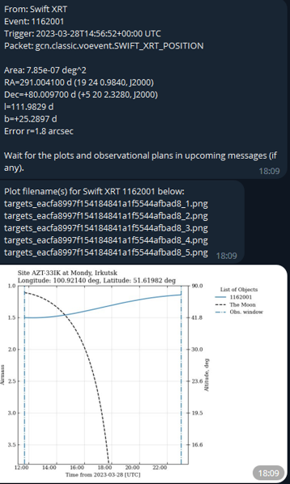
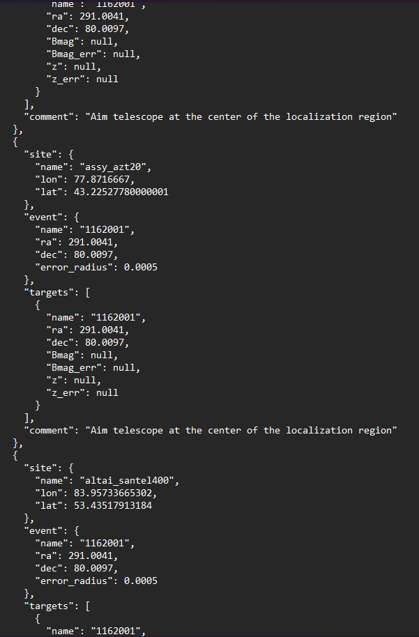
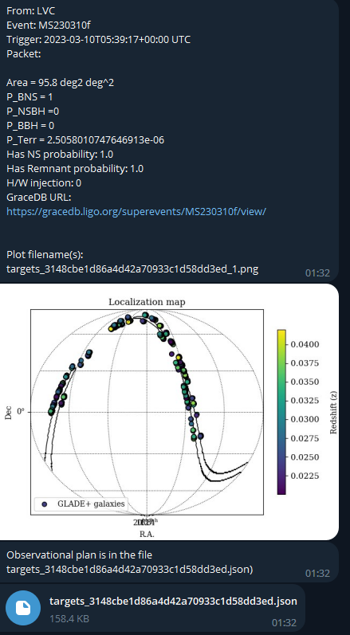
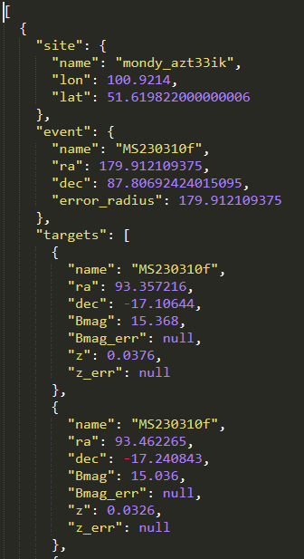

# AWARE

**"AWARE"** is acronim for **"Alert Watcher and Astronomical Rapid Exploration"** is a 
Python application for receiving and processing the Kafka Messages distributed via the 
GCN https://gcn.nasa.gov broker for alerts on high-energy transient events such as 
GRBs and gravitational wave events detected by LIGO/Virgo/KAGRA interferometers. 
Besides that, **AWARE** provides optimal scheduling for the observations of these 
astronomical phenomena with telescopes. The AWARE uses gcn_kafka 
https://github.com/nasa-gcn/gcn-kafka-python and confluent_kafka 
https://github.com/confluentinc/confluent-kafka-python under the hood, which provide convinient way for working with GCN/TAN Confluent Kafka broker. Once alert message were received by the AWARE, they almost immediately sent to the subscribers of the Telegram channel. After that, the AWARE is making observational plan for the specified list of observatories depending on the event type (more detailed in next paragraphs).

# Installation

Download an .whl file from tags and run pip:

`pip install AWARE-0.1.0-py3-none-any.whl --no-build-isolation`

Or build from source:
   ```
   git clone https://github.com/mickolaua/aware-repo.git

   cd aware repo

   pip install .
   ```

# Receiving GCN alerts

The simplest way to receive messages is when a person has an access to the Telegram 
channel controlled by the AWARE bot instance. One just needs to subscribe to the 
channel via inventation link.

It is possible to deploy your own bot instance. First off, one needs to authorize to 
the <gcn.nasa.gov> and get credentials (id and secret) to receive raw messages from 
GCN. After that, set-up enviromental variables:

PowerShell:

``$Env:GCN_KAFKA_CLIENT_ID="<your actual id>"``

``$Env:GCN_KAFKA_CLIENT_SECRET="<your actual secret>"``

Bourne shell (bash/sh/zsh):

``export GCN_KAFKA_CLIENT_ID=<your actual id>``

``export GCN_KAFKA_CLIENT_SECRET=<your actual secret>``

Go ahead and install the aware package like specified in previous paragraph 
**Installation**.

Next step is to get credentials for the Telegram bot creation. In the Telegram one has 
to contact https://telegram.me/BotFather, choose bot name and get API token. The great tutorial with screenshots on how to do that could be find, for example, here 
<https://sendpulse.com/knowledge-base/chatbot/telegram/create-telegram-chatbot>. Then, 
write this API token to the enviromental variable:

PowerShell:

``$Env:AWARE_TG_API_TOKEN="<your actual API token>"``

Bourne shell (bash/sh/zsh):

``export AWARE_TG_API_TOKEN=<your actual API token>``

Now everything is completed to run the AWARE. Just type this command in any shell:

``python -m aware``

Note. It is desired to create a working folder in which the AWARE will be executed, 
since there are a lot of observational plots and plans could be generated during the 
its run. 

Optionally, one can overwrite the default options like, list of event types to listen, 
logging format, and other parameters. The default config file `aware.yaml` is located 
in this repository. Access to the config file is provided via enviromental variable:

PowerShell:

``$Env:AWARE_CONFIG_FILE="path/to/config.yaml"``

Bourne Shell (bash, sh, zsh):

``export AWARE_CONFIG_FILE=path/to/config.yaml``


# Interaction with bot

A Telegram user can interact with bot using these commands:

`/run`

Run the communication with alert message consumer thread. This command must be executed 
in order that all the channel subscribers could receive alert messages in real-time as 
well as any related observational information.

`/stop`

Stop receiving messages.

`/status`

Check if bot is idle or broadcasting messages.

`/telescopes`

Get the list of telescopes for which observation planning is available.

`/topics`

Get the list of GCN event types to be received

`/help`

Display the help on bot commands.

Text commands:

1. Finding chart image:

just type something like: `TRANSIENT_NAME 133.33 35.33` to get DSS finding chart of 
the target TRANSIENT_NAME at coordinates RA=133.33 DEC=35.33 (J2000).


Planning the observations
=========================
Depending on the event type (for example, SWIFT_XRT_POSITION or LVC_PRELIMENARY) and 
localization uncertainty, observational information is different. For example, events 
sent by Fermi, Swift, INTEGRAL, IceCube are localized within approximately circular 
region in the sky. In this case, a typical localization area is up to a few degrees 
(excluding Fermi GBM). For these events, the AWARE planner creates the airmass plot 
for the center of the localization region if it is could be observable by a telescope.

For example, the what will send the bot on an XRT alert:

<figure align="center">
   
   <figcaption>Fig. 1 -The alert message and visibility plot of the Swift Trigger #1162001 for AZT-33IK at Mondy observatory.</figcaption>
</figure>

The corresponding JSON-file will include only one target per each telescope:

<figure align="center">
   
   <figcaption>Fig. 2 - An example of XRT observational plan stored in the JSON-file.</figcaption>
</figure>

## LVC observations
The message content is different from that for previously mentioned alert types. It 
includes probabilities for event to be a binary neutron star merger, neutron star 
black hole merger, binary black hole merger, or earthquake. An example of the message 
sent by Telegram bot is shown here:

<figure align="center">
   
   <figcaption>Fig. 3 - An example of the LVC event alert message and skymap plot.</figcaption>
</figure>

Compared with above type of events, LVC events have up to 1000 deg $^2$ localization areas. To explore such large sky fields, two methods of observation planning are being 
developed. 

### Target observations

This method is best suited for narrow field-of-view telescopes, for example, 15x15 
arcmin squared. Observational targets are GLADE+ galaxies that are contained inside 
the 90% probability volume of the localization region. The example JSON-file with 
GLADE+ target is shown bellow:

<figure align="center">
   
   <figcaption>Fig. 4 - An example of JSON-file for LVC event.</figcaption>
</figure>

Note. Only those targets that observable by the certain telescope in the nearest observational window are in the list. 


### Mosaic observations (WiP)

The mosaic (e.g. tile, sky-field) observations is applicable for wide-field telescopes, 
with FOV $\gtrsim 40$ arcmin. First off, algorithm re-grids the skymap in the tiles of 
size 0.9xFOV (10% is accounted for any artefacts at the image edges). Then, the post probable tile is the chosen as the start point. The algorithm walks through most 
probable to least probable tiles strictly N_ITER steps. After algorithm has finished, 
the list of tile centers written to the JSON-file.


